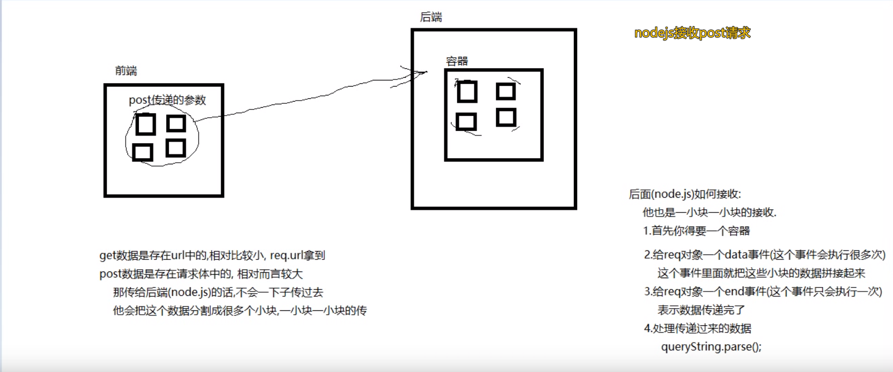
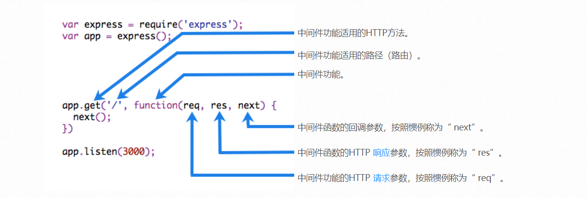
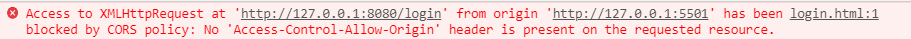
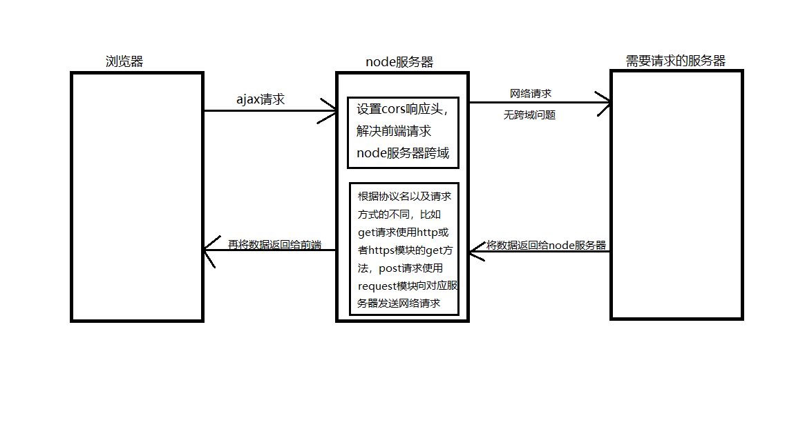

# LearnNode

## 内置模块fs的使用

### unlink 删除

> 参数一： 文件的路径
>
> 参数二： 回调函数

```js
const fs = require('fs');

fs.unlink('./hello/hello.txt', (err) => {
  if (err) throw err;
  console.log('已成功地删除文件');
});
```

###  readFile 读取文件

> 参数一：文件的路径
>
> 参数二：可选参数，读取文件的编码格式
>
> 参数三：回调函数

```js
fs.readFile('./hello/hello.txt', "utf8", (err, data) => {
  /**
   * err 是一个错误对象，如果没有错就返回一个null
   * data是读的文件内容，如果可选参数没有的话，默认是一个Buffer文件流
   */
  if (err) throw err;
  console.log(data);
});
```

### writeFile 写入文件

>   writeFile 写文件
>
>  参数一：写入文件的路径（如果路径中没有这个文件夹会报错，如果没有这个文件，会自动帮你建这个文件夹）
>
>  参数二：要写入的内容
>
>  参数三：回调函数

```js
const fs = require("fs");

const data = `
              诫子书  
              诸葛亮
    夫君子之行，静以修身，俭以养德。
    非淡泊无以明志，非宁静无以致远。
              ...
`;

fs.writeFile("./hello/shi.txt", data, (err) => {
  if (err) throw err;
  console.log("文件已保存");
});
```

## 内置模块path的使用

nodejs中相对路径，相对的是谁？

相对的是运行这个node文件的 小黑框 的路径而言的

### 和路径相关的两个变量

+ __dirname: *获取的是当前这个文件所在的这个文件夹的绝对路径*
+ __filename: *获取的是当前这个文件的绝对路径*

**我们可以通过这两个变量对我们想要的路径进行拼接**

```js
const mypath = `${__dirname}/etc/hello.txt`;
```

### 内置模块path的基本使用

我们通过手动拼接绝对路径，可能会出现错误(少写 \ )导致路径不对，为了避免这个问题，我们就可以使用path模块来拼接路径。

下面来进行对比一下：

```js
const path = require("path");

// join方法是把路径片段连接成一个新的路径
const myPath1 = path.join(__dirname,"etc","hello.txt");
const myPath2 = `${__dirname}\\etc\\hello.txt`;

console.log(myPath1); // E:\study_web\learnNode\内置模块path模块\etc\hello.txt
console.log(myPath2); // E:\study_web\learnNode\内置模块path模块\etc\hello.txt
console.log(myPath1 === myPath2);  // true
```

## 内置模块http的使用

### 使用http模块创建一个服务器

```js
// 使用内置模块http来创建一个服务器

// 1.导入http模块
const http = require("http");

// 2.创建一个服务器
const server = http.createServer((request, response) => {
  // 如果想要返回的中文不乱码，就要设置响应头
  response.setHeader("Content-Type", "text/html;charset=utf8");

  // 3.设置返回给用户看的内容
  // response.end("hello coderdxh!");
  response.end("你好，coderdxh");
});


// 4.开启服务器
server.listen(8080,() => {
  console.log("服务器开启了：8080");
});
```

### web服务器读取网页返回给用户

```js
// 1.引入http，fs，path模块
const fs = require("fs");
const http = require("http");
const path = require("path");

// 获取页面路径
const fullPath = path.join(__dirname, "page", "index.html");

// 2.创建服务器
const server = http.createServer((request, response) => {
  // 读取页面
  fs.readFile(fullPath, "utf8", (err, data) => {
    if (err) response.end(404);
    response.end(data)
  });
});

// 3. 开启服务器
server.listen(8080, () => {
  console.log("sussess");
});
```

### 创建静态服务器

```js
// 创建静态资源服务器
// 要求：浏览器访问什么资源就返回什么资源，如果没有这个资源就返回404页面
// 1.设置http，fs，path模块
const path = require("path");
const fs = require("fs");
const http = require("http");

// 2.创建服务器
const server = http.createServer((request, response) => {
  // 3.设置返回给用户的内容
  // 首先得知道用户请求的是哪一个页面(哪一个资源)
  // console.log(request);  // 用户请求过来的内容，里面的url包含请求的资源名字
  // console.log(request.url);

  console.log(request.url.split(".")[1]);

  let fullPath;

  if (request.url.split(".")[1] === "html") {
    fullPath = path.join(__dirname, "page", request.url);
  } else if (request.url.split(".")[1] === "jpg"){
    fullPath = path.join(__dirname, "img", request.url);
  } else if (request.url.split(".")[1] === "ico") {
    return;
  }

  // 读取文件
  // 服务器会有一个嗅探功能
  // 它根据请求的资源名字，能够知道你请求的是什么类型的资源
  fs.readFile(fullPath, (err, data) => {
    if (err) { response.end("404 Not Found"); }
    response.end(data);
  });
});

// 4.开启服务器
server.listen(8080, () => {
  console.log("success");
});
```

## nodejs接收get传递过来的参数

```js
/**
 * 前端传参
 *    get传参：拼接在url上面
 *      http://127.0.0.1:8080/joke?id=1&username=admin
 *    post传参：不是拼接在url上面
 *      是在请求体中传递
 */

const http = require("http");
const url = require("url");

const server = http.createServer((request, response) => {
  // request是请求的对象，requset.url能拿到请求来的url中的?以及？后面的内容
  console.log(request.url);  // "/?id=10&name=%E6%B3%A2%E6%B3%A2"

  // 我们可以通过request.url拿到前端传递过来的参数
  // 但是要做字符串处理
  // 我们可以使用nodejs的一个模块：url模块
  // 调用它的parse方法
  // 参数一：就是要处理的url
  // 参数二：如果给true的话，就返回一个对象。
  const urlObj = url.parse(request.url,true);
  console.log(urlObj); // query: [Object: null prototype] { id: '10', name: '波波' },

  // 这个返回的对象里面有一个query属性，它也是一个对象，这个属性里面就有get传递的参数
  console.log(urlObj.query);

  // 那就可以在这里根据这个收到的id，去数据库中获取这个id的所有信息
  // 返回给调用者

  // 如果在这里拿到id对应的英雄的详细信息了，就可以返回
  response.end(JSON.stringify(urlObj.query)); // 只能返回字符串
});

server.listen(8080, () => {
  console.log("success...");
});
```

## nodejs接收post传递过来的参数



```js
/**
 * 前端传参
 *    get传参：拼接在url上面
 *      http://127.0.0.1:8080/joke?id=1&username=admin
 *    post传参：不是拼接在url上面
 *      是在请求体中传递
 */

const http = require("http");
const querystring = require("querystring");

const server = http.createServer((request, response) => {
  // request是请求对象
  // 因为这里的post方式传递过来的参数不在url中，所以用request.url是拿不到的

  // 那如何拿呢？
  // 一小块一小块的拿
  // 1.你得有一个容器
  let postData = "";
  // 2.给request对象一个data事件
  // 事件处理程序 参数是当前这次传递过来的这一小块内容
  request.on("data", (chunk) => {
    postData += chunk;
  });

  // 3.给request对象一个end事件
  // 表示数据传递完成了。
  request.on("end", () => {
    // 打印看看
    console.log(postData); // name=admin&password=123456

    // 4.解析这个传递过来的参数数据
    const postObj = querystring.parse(postData);
    console.log(postObj);  // { name: 'admin', password: '123456' }

    // 5.
    // 那在这里我们就可以根据这个传递过来的账号和密码，去数据库中判断是否正确
    // 如果正确的那在这里就可以告诉用户，账号密码正确
    response.end("coderdxh");
  });

});

server.listen(8080, () => {
  console.log("success...");
});
```

## express的使用

### express的基本使用

```js
const express = require("express");

const app = express();

app.get("/", (request, response) => {
  response.send("hello coderdxh");
});

app.listen(8080, () => {
  console.log("success...");
});
```

### express 搭建静态资源服务器

```js
// 创建静态资源服务器 --- express
// 为了提供诸如图像、CSS 文件和 JavaScript 文件之类的静态文件，请使用 Express 中的 express.static 内置中间件函数。
const express = require("express");

// 创建服务器
const app = express();

// 例如，通过如下代码就可以将 web 目录下的图片、CSS 文件、JavaScript 文件对外开放访问了：
app.use(express.static("web"))

// 开启服务器
app.listen(8080, () => {
  console.log("success...");
});
```

### 实现一个简单的get接口

```js
/**
 * 接口：得到一条随机笑话
 * 接口地址： /joke
 * 请求方式：get
 * 参数：无
 * 返回：一条笑话
 */

const express = require("express");

const app = express();

app.get("/joke", (request, response) => {
  // 准备n条数据，实际开发的时候笑话肯定是从数据库或者其他数据源获取到的
  let jokeArr = ["狐狸容易摔跤，因为它特别脚滑", "波波是男的", "想不出来了"];
  let index = Math.floor(Math.random() * 3); // 0 1 2
  // 返回笑话
  response.send(jokeArr[index]);
})

app.listen(8080,() => {
  console.log("success...");
});
```

### 实现一个返回json数据的接口

```js
/**
 * 接口：返回一个食物
 * 接口地址： /food
 * 请求方式：get
 * 请求参数：无
 * 返回值：json
 */

const express = require("express");

const app = express();

app.get("/food", (request, response) => {
  response.send({
    foodName: "红烧肉",
    price: 30,
    description: "油而不腻，美味"
  });
})

app.listen(8080,() => {
  console.log("success...");
});
```

### 实现一个get带有参数的接口

```js
/**
 * 接口: 查询英雄外号
 *       根据英雄名返回英雄外号
 * 接口地址： /getNickName
 * 请求方式： get
 * 请求参数：heroName
 *          英雄名(提莫/盖伦/李青...)
 * 返回值：英雄外号
 */

const express = require("express");

const app = express();

app.get("/getNickName", (request, response) => {
  console.log(request.query);  // { heroName: '提莫' }

  let heroNickName = "";

  switch (request.query.heroName) {
    case "提莫":
      heroNickName = "迅捷斥候";
      break;
    case "亚索":
      heroNickName = "疾风剑豪";
      break;
    case "盖伦":
      heroNickName = "德玛西亚之力";
      break;
    case "火男":
      heroNickName = "复仇焰魂";
      break;
    default:
      heroNickName = "该英雄不存在";
      break;
  }
  response.send(heroNickName);
})

app.listen(8080, () => {
  console.log("success...");
});
```

### 实现一个post带有参数的接口

```js
/**
 * 接口：用户登录
 * 请求地址：/login
 * 请求方式：post
 * 请求参数：username  password
 *          用户名     密码
 * 返回值：登录成功/登录失败
 */

const express = require("express");
const bodyParser = require("body-parser");

const app = express();

// parse application/x-www-form-urlencoded
app.use(bodyParser.urlencoded({ extended: false }))
 
// parse application/json
app.use(bodyParser.json())

app.post("/login", (request, response) => {
  // 接收用户传递过来的用户名和密码

  // 由于是post方式传递过来的参数，所以用request.query这种方式拿不到
  // 想要获取到通过post传递过来的参数，我们就要使用第三方模块 ： body-parser
  console.log(request.body); // { username: 'admin', password: '123456' }

  if (request.body.username === "admin" && request.body.password === "888888") {
    response.send({
      code: "200",
      msg: "登录成功"
    });
  } else {
    response.send({
      code: "400",
      msg: "账号密码不正确"
    });
  }
})

app.listen(8080, () => {
  console.log("success...");
});
```

### 实现一个post带有参数传文件的接口

```js
/**
 * 注册接口
 * 接口地址：/register
 * 请求方式：post
 * 请求参数：username password usericon(用户头像，图片文件)
 * 返回数据：注册成功/注册失败
 */

const express = require("express");
const multer = require("multer");

// 创建一个uploads这个文件夹
const upload = multer({ dest: 'uploads/' })

const app = new express();

app.post('/register', upload.single('usericon'), function (req, res) {
  // req.file is the `usericon` file // 传过来的文件，参数名用usericon
  // req.body will hold the text fields, if there were any  // 一起传过来的文件保存在req.body中

  console.log(req.file);  // 记录了传递过来的文件的一些信息
  console.log(req.body);  // { username: 'coderdxh', password: '123456' }

  res.send("sb");
})


app.listen(8080, () => {
  console.log("success...");
});
```

## Learn middleware

*中间件*功能是可以访问请求对象（`req`），响应对象（`res`）以及`next`应用程序的请求-响应周期中的功能的功能。该`next`功能是Express路由器中的功能，当调用该功能时，将在当前中间件之后执行中间件。

中间件功能可以执行以下任务：

- 执行任何代码。
- 更改请求和响应对象。
- 结束请求-响应周期。
- 调用堆栈中的下一个中间件。

如果当前中间件功能没有结束请求-响应周期，则必须调用`next()`将控制权传递给下一个中间件功能。否则，该请求将被挂起。

下图显示了中间件函数调用的元素：



### 简单使用

```js
const express = require("express");

const app = express();

// 就是服务器开启之后和路由响应之前，执行的一个函数
// 这个函数是可以操作req, res 的
// next()函数就是让你去执行下一个中间件的

// 中间件
app.use((req, res, next) => {
  req.requestTime = Date.now();
  res.name = "coderdxh";
  console.log('LOGGED')
  next()
})

app.get("/", (req, res) => {
  console.log(req.requestTime);  // 1597849701585
  res.send(res.name);
});

app.listen(8080, () => {
  console.log("success...");
});
```

## 跨域

### 跨域介绍

#### 1. 跨域固定报错格式

   **只要是出现跨域问题，浏览器就会出现一个固定格式(没有之一)的报错信息**

   > Access to XMLHttpRequest at '服务器url地址' from origin 'http://127.0.0.1:5501' has been blocked by CORS policy: No 'Access-Control-Allow-Origin' header is present on the requested resource.

   

#### 2.  什么是跨域

   浏览器使用`ajax`时，如果请求了的`接口地址`和当前`打开的页面`地址`不同源`称之为跨域。

   + ajax：浏览器只有使用ajax发送请求才会出现跨域。href属性和src属性不会出现跨域。
   + 接口地址：ajax请求的url
   + 打开的页面：当前页面的window.location.href
   + 不同源：浏览器使用ajax，向不同源的接口发送请求，称之为 **跨域访问**。

#### 3. 什么是同源？
   + MDN：https://developer.mozilla.org/zh-CN/docs/Web/Security/Same-origin_policy
   + 同源定义：两个url地址的`协议`和`主机`和`端口`均一致
     + 协议：http,https,file
     + 主机：域名或者ip地址
     + 端口：8080等等
   + 不同源定义：两个url地址，`协议` `主机` `端口`三者中只要有一个不一致

4. 跨域解决方案介绍
   + 跨域是前端工作中不可避免的问题：我们经常会出现请求不同源接口的情况，为了能获取数据，解决跨域的问题方案也有很多，但是常用的就两种
   + 第一种：`CORS`
     + 目前的主流方案，也是最简单的方案，直接让后端设置响应头，允许资源共享就ok.
   + 第二种：`JSONP`
     + 曾经的跨域杀手，专治各种跨域问题。现在慢慢的淡出历史舞台
     + PS：面试官特别喜欢问这个，因为这个有一定的技术难度，也能体现一个人的实际开发经验
     + jsonp是前后端配合来使用的
     + 使用原理：通过动态创建script标签，通过script标签的src属性请求没有跨域权限来获取资源

#### 4.在中间件里设置允许资源共享cors来解决跨域限制

```js
app.use((req, res, next) => {
  // 在这里设置响应头，允许资源共享
  res.setHeader("Access-Control-Allow-Origin", "*");
  next();
});
```

```js
// 使用cors模块 需要先npm i cors
const cors = require("cors");
const express = require("express");

const app = express();

// 这句话和我们自己上边写的那个中间件设置资源共享的效果相同。
app.use(cors());
```

#### 5.jsonp的简单使用

```html
<!DOCTYPE html>
<html lang="en">

<head>
  <meta charset="UTF-8">
  <meta name="viewport" content="width=device-width, initial-scale=1.0">
  <title>Document</title>
</head>

<body>
  <script>
    const foo = () => {
      console.log("foo执行了")
    }
    const fn = (backData) => {
      console.log("我是事先准备好的fn函数");
      console.log(backData);
    }
  </script>

  <!-- 把事先准备好的函数名传递给后端接口 -->
  <script src="http://127.0.0.1:8080/all?callback=fn"></script>
  
</body>

</html>
```

```js
const express = require("express");

const app = express();

app.get("/all", (req, res) => {
  // res.send(`foo();`);
  // 现在有一个问题，就是返回的这个函数调用，我怎么知道应该返回什么样的函数名呢？
  // 或者说我这里怎么知道访问我这个接口的前端页面有什么样的写好的函数呢？
  // 所以写死 foo() 不合理
  // 解决办法是：前端把已经准备好的函数名用参数的形式带过来

  // console.log(req.query); // { callback: 'fn' }
  // res.send(`${req.query.callback}();`);

  // 我还想传递数据给前端
  const data = { "username": "coderdxh", "password": "123456" };
  res.send(`${req.query.callback}(${JSON.stringify(data)});`);
});

app.listen(8080, () => {
  console.log("success...");
});
```

#### 6.node服务器代理(新增)

​        有些情况，我们以上两种都不能解决我们的跨域问题，比如后端程序员不配合，或者说后端程序员设置跨域了，但是设置的允许跨域的是对应网站的协议域名端口号，而我们日常开发时还是通过本地服务器发送的网络请求(比如live-server开启的是127.0.0.1:5500),同样存在跨域问题，那我们应该怎么做呢？这时，就用到了node服务器代理。



​		首先，我们要理解的是，ajax请求是不是存在同源策略的限制，所以我们有跨域的问题。但是呢，我们可以通过node服务器往其他服务器发送网络请求，这是不遵循同源策略的，因此不会产生跨域问题。我们通过express搭建node服务器很简单:

```js
const express = require("express");

const app = new express();

app.get("/getNews",(req, res) => {
    // 先不写具体内容，只是express搭建node服务器
    res.send();
});

app.listen(8080, () => {
    console.log("8080端口开启了...");
})
```

​		然后，node服务器怎么发送网络请求呢？这时，我们要看我们请求的url地址是 http 协议还是 https 协议，如果是 http 协议那么我们就用 http 模块，如果是 https 协议，那我们就要用 https 模块。假设我们请求的url地址是 https 协议，我们用到的就是 https 模块。

​		那么，我们用 https 模块如何发送网络请求呢? 如果是get请求的话，我们使用 https.get()。node的 https 模块发起请求之后，由于此时node服务器充当一个接收数据的角色，而数据接收时是通过一小块(chunk)传过来的，因此我们要绑定**data事件**(这个事件会执行多次，在这个事件中我们就把这些小块儿数据拼接起来),还有一个 **end 事件** (这个事件只执行一次，表示数据已经传递完了)，然后把处理后的数据返回给前端。

​		前端请求 node 服务器，是不是也有跨域问题？所以我们要设置 **CORS** 响应头。这样前端访问 node 服务器也没有跨域问题了，而 node 服务器访问 对应服务器也没有跨域问题；然后对应服务器把数据返回给 node 服务器，node 服务器再把数据返回给前端。这样就解决了跨域问题，这种方式就叫做 **node 服务器代理解决跨域问题**。

```js
const express = require("express");
const https = require("https");

const app = new express();

// 这里也可以使用 cors 插件
app.use((req, res, next) => {
  // 设置响应头 解决跨域的问题
  res.setHeader("Access-Control-Allow-Origin", "http://127.0.0.1:5500");
  next();
});

app.get("/getNews",(req, res) => {
    const {channel, appKey} = req.query;
  	const netUrl = `https://api.jisuapi.com/news/get?channel=${channel}&start=0&num=10&appkey=${appKey}`;
    https.get(netUrl, function(responseObj) {
        // node的https模块发起请求之后， 回调函数里的参数不是获取到的数据， 是一个响应对象， 数据存储在该对象内部， 我们通过对该对象进行监听才能拿到数据
        let allData = "";
        responseObj.on("data", function(chunk) {
            allData += chunk;
        });
        responseObj.on("end", function() {
            const data = JSON.parse(allData);
            res.send(JSON.stringify(data));
        })
    });
});

app.listen(8080, () => {
    console.log("8080端口开启了...");
})
```

那如果是post请求呢？虽然node官网给我们了http/https.request这个api，但是用起来不方便，所以我们可以使用**request**模块， **npm i request** ,通过这个模块就可以发送post请求。

```js
const express = require("express");
const bodyParser = require("body-parser"); 
const request = require("request");

const app = new express();

app.use((req,res,next) => {
  res.setHeader("Access-Control-Allow-Origin", "http://127.0.0.1:5500");
  next();
})

// parse application/x-www-form-urlencoded
app.use(bodyParser.urlencoded({ extended: false }))
 
// parse application/json
app.use(bodyParser.json())

app.post("/addFood", (req, res) => {
  // 接收前端传来的数据
  const { name, description, restaurant_id } = req.body;

  // 将数据保存在一个对象中
  const postData = {
    'name': name,
    "description": description,
    "restaurant_id": Number(restaurant_id)    
  };

  // 发送网络请求
  request({
    url: "https://elm.cangdu.org/shopping/addcategory",
    method: "POST",
    json: true,
    headers: {
      "content-type": "application/json"
    },
    body: JSON.stringify(postData)
  }, (error, response, body) => {
    if (!error && response.statusCode == 200) {
      // 不报错并且状态码为200时，说明请求到结果了，将数据返回给前端即可。
      res.send(JSON.stringify(body));
    }
  })
});

app.listen(8080, () => {
  console.log("8080端口已开启...")
});
```

## sql语句

### 增删改查语句

####  增删改查的意思

+ 增：新增记录 insert
+ 删：删除记录 delete
+ 查：查询记录 select
+ 改：修改记录 update 

#### insert语句

> insert 语句对应的是"增"，也即是新增数据。

**基本用法**

```sql
insert into 表名(字段名) values(值);
```

**举例**

```sql
insert into student(name,age) values("andy", 20);
```

这表示给 student 表新增一条数据，name的值为 andy，age 的值为 20。

#### delete语句

> delete 语句对应的是"删"，也即是删除数据。

**基本用法**

```sql
delete from 表名 where 条件
```

**举例**

```sql
delete from student where name = "coderdxh";
```

这表示删除 student 表 name 为 "coderdxh" 的 那条数据。

#### update语句

> update 语句对应的是"改"，也即是修改数据。

**基本用法**

```sql
update 表名 set 字段名 = 新值 where 条件;
update 表名 set 字段名1 = 新值1, 字段名2 = 新值2 where 条件
```

**举例**

```sql
update student set name = "coderdxh" where name = "dxh";
```

这表示 修改 student 表 name 为 "dxh" 的那条数据的 name 为 "coderdxh"

#### select语句

> select 语句对应的是"查"，也即是查询数据。

**基本用法**

```sql
select * from 表名;
select 字段名1,字段名2 from 表名
select 字段名1,字段名2 from 表名 where 条件;
```

**举例**

```sql
select name,age from student where age > 18;
```

这表示查询 student 表 中 age 大于18的name,age字段的数据。

## nodejs中操作mysql

想要在nodejs中操作mysql数据库，首先要安装mysql模块，`npm i mysql` 。

由于最新的mysql模块并未完全支持MySQL 8的**caching_sha2_password**加密方式，而**caching_sha2_password**在MySQL 8中是默认的加密方式。

因此，使用nodejs的mysql模块运行代码会报错：`ER_NOT_SUPPORTED_AUTH_MODE`

**解决办法：**

解决方法是重新修改用户root的密码，并指定mysql模块能够支持的加密方式：

```
mysql> ALTER USER 'root'@'localhost' IDENTIFIED WITH mysql_native_password BY '123456';
Query OK, 0 rows affected (0.12 sec)
```

上述语句，显示指定了使用“mysql_native_password”的加密方式。这种方式是在mysql模块能够支持。

### nodejs操作数据库---查

```js
const mysql  = require('mysql');

// 创建一个和数据库的连接
const connection = mysql.createConnection({
  host : 'localhost', // 数据库服务器的地址
  user : 'root', // 账号
  password : '123456', // 密码
  database : 'test01'  // 数据库名
});
 
// 打开连接
connection.connect();
 
// 执行sql语句
connection.query('select * from user', function (error, results, fields) {
  // error 错误对象，如果没有报错就返回null
  // console.log(error);
  // results 执行sql语句得到一个结果集 有错误就是 undefined
  // console.log(results);
  // console.log(results[4].username); // coderdxh

  // fields 拿到的是字段的信息，不常用
  // console.log(fields);
});
 
// 关闭连接
connection.end();
```

### nodejs操作数据库---增

```js
const mysql  = require('mysql');

// 创建一个和数据库的连接
const connection = mysql.createConnection({
  host : 'localhost', // 数据库服务器的地址
  user : 'root', // 账号
  password : '123456', // 密码
  database : 'test01'  // 数据库名
});
 
// 打开连接
connection.connect();

// 前端传递过来的数据
let username = "coderdxh";
let password = 888888;
 
// 执行sql语句
connection.query(`insert into user(username,password) values('${username}', ${password})`, (error, results) => {
  if (error == null) {
    console.log(results); // 返回的结果是一个对象
    console.log(results.affectedRows); // 如果受影响的行数大于零，说明新增成功了
    console.log(results.insertId); // 插入这条数据的Id
  }
});
 
// 关闭连接
connection.end();
```

### nodejs操作数据库---改

```js
const mysql  = require('mysql');

// 创建一个和数据库的连接
const connection = mysql.createConnection({
  host : 'localhost', // 数据库服务器的地址
  user : 'root', // 账号
  password : '123456', // 密码
  database : 'test01'  // 数据库名
});
 
// 打开连接
connection.connect();

// 前端传递过来的数据
let id = 8;
let username = "dxhcoder";
let password = 666666;
 
// 执行sql语句
connection.query(`update user set username = '${username}', password = ${password} where id = ${id}`, (error, results) => {
  if (error == null) {
    console.log(results); // 返回的结果是一个对象
    console.log(results.affectedRows); // 如果受影响的行数
    console.log(results.changedRows); // 改变的行数
  }
});
 
// 关闭连接
connection.end();
```

### nodejs 操作数据库---删

```js
const mysql  = require('mysql');

// 创建一个和数据库的连接
const connection = mysql.createConnection({
  host : 'localhost', // 数据库服务器的地址
  user : 'root', // 账号
  password : '123456', // 密码
  database : 'test01'  // 数据库名
});
 
// 打开连接
connection.connect();

// 前端传递过来的数据
let id = 7; // 要删除的id
 
// 执行sql语句
connection.query(`delete from user where id = ${id}`, (error, results) => {
  if (error == null) {
    console.log(results); // 返回的结果是一个对象
    console.log(results.affectedRows); // 如果受影响的行数
  }
});
 
// 关闭连接
connection.end();
```

## nodejs中操作mongoDB

### nodejs操作数据库---增

```js
const mongoose = require("mongoose");

// 连接数据库
mongoose.connect('mongodb://localhost/nodetestdb', {
  useNewUrlParser: true,
  useUnifiedTopology: true
});

// 需要监听数据库的连接状态，针对数据库的所以操作(CRUD),必须建立在数据库已经成功连接的基础上
mongoose.connection.on('open', (err) => {
  if (!err) {
    console.log('数据库连接成功了！');
    /**
     * 创建Model
     * 创建一个schema对象，并给该对象设置结构
     * 再通过schema对象创建一个Model
     */

    const Schema = mongoose.Schema;

    const SchemaObj = new Schema({
      name: { type: String, default: "coderdxh" },
      age: { type: Number, default: 18 },
      sex: String
    }, { collection: "student", versionKey: false });
    // versionKey:false 可以去掉版本号

    // 创建模型时，参数一与collection的值保持一致
    const myModel = mongoose.model("student", SchemaObj);

    /**
     * 插入数据
     * 语法：
     *  对象模型.create({
     *  key: value
     *  key: value
     *  ...
     * },回调函数)
     */

    myModel.create({
      name: "董鑫华",
      age: 20,
      sex: "男"
    }, (error, result) => {
      if (!error) {
        console.log("添加成功" + result);
      } else {
        console.log("添加失败");
      }
    })

  } else {
    throw err;
  }
})
```

### nodejs操作数据库---删

```js
const mongooes = require("mongoose");

// 连接数据库
mongooes.connect('mongodb://localhost/nodetestdb', {
  useNewUrlParser: true,
  useUnifiedTopology: true
});

// 监听数据库连接的状态
mongooes.connection.on("open", (err) => {
  if (err) throw err;
  console.log("数据库连接成功了");

  // 引入约束Schema
  const Schema = mongooes.Schema;
  // 创建一个约束对象实例
  const StudentSchema = new Schema({
    name: { type: String, default: "coderdxh" },
    age: { type: Number, default: 18 },
    sex: String
  }, { collection: "student", versionKey: false });
  // 创建模型对象
  // 第一个参数与数据库中的集合相对应，第二个参数指定约束对象实例
  // 只要生成了模型对象，就可以进行数据的：增删改查
  const studentModel = mongooes.model("student", StudentSchema);
  // 删除数据

  /* studentModel.remove({_id:"5f4521cc521b4e169006be8b"},(error,result)=>{
    if (error) throw error;
    //  DeprecationWarning: collection.remove is deprecated. Use deleteOne, deleteMany, or bulkWrite instead.
    console.log(result);
   }); */

    /* studentModel.deleteOne({_id:"5f4521b9ea542d06bc745fd3"},(error,result)=>{
    if (error) throw error;
    console.log(result);
   }); */

   studentModel.deleteMany({name: "coderzyq"},(error,result)=>{
    if (error) throw error;
    console.log(result);
   });

});
```

### nodejs操作数据库---改

```js
const mongooes = require("mongoose");

// 连接数据库
mongooes.connect('mongodb://localhost/nodetestdb', {
  useNewUrlParser: true,
  useUnifiedTopology: true
});

// 监听数据库连接的状态
mongooes.connection.on("open", (err) => {
  if (err) throw err;
  console.log("数据库连接成功了");

  // 引入约束Schema
  const Schema = mongooes.Schema;
  // 创建一个约束对象实例
  const StudentSchema = new Schema({
    name: { type: String, default: "coderdxh" },
    age: { type: Number, default: 18 },
    sex: String
  }, { collection: "student", versionKey: false });
  // 创建模型对象
  // 第一个参数与数据库中的集合相对应，第二个参数指定约束对象实例
  // 只要生成了模型对象，就可以进行数据的：增删改查
  const studentModel = mongooes.model("student", StudentSchema);

  /**
   * 修改数据
   * 模型对象.update(查询条件(一般是主键类型的值),{$set:修改的值},是否一次修改多个值, 回调函数)
   */

   /* studentModel.update({_id:"5f4521b71638dd3c54e15ebf"},{$set:{age:21}},(error,result)=>{
    if (error) throw error;
    //  DeprecationWarning: collection.update is deprecated. Use updateOne, updateMany, or bulkWrite instead.
    console.log(result);
   }); */

   // 修改单个
   /* studentModel.updateOne({_id:"5f4521b71638dd3c54e15ebf"},{$set:{age:20}},(error,result)=>{
    if (error) throw error;
    console.log(result);
   }); */

   // 修改多个
   studentModel.updateMany({name: "coderdxh"},{$set:{age:20}},(error,result)=>{
    if (error) throw error;
    console.log(result);
   });


});
```

### nodejs操作数据库---查

```js
const mongoose = require("mongoose");

// 连接数据库
mongoose.connect('mongodb://localhost/nodetestdb', {
  useNewUrlParser: true,
  useUnifiedTopology: true
});

// 需要监听数据库的连接状态，针对数据库的所以操作(CRUD),必须建立在数据库已经成功连接的基础上
mongoose.connection.on('open', (err) => {
  if (!err) {
    console.log('数据库连接成功了！');
    /**
     * 创建Model
     * 创建一个schema对象，并给该对象设置结构
     * 再通过schema对象创建一个Model
     */

    const Schema = mongoose.Schema;

    const SchemaObj = new Schema({
      name: { type: String, default: "coderdxh" },
      age: { type: Number, default: 18 },
      sex: String
    }, { collection: "student", versionKey: false });
    // versionKey:false 可以去掉版本号

    // 创建模型时，参数一与collection的值保持一致
    const myModel = mongoose.model("student", SchemaObj);

    // 查询数据
    // 模型对象.find(条件(可选),想要获取的字段(可选),筛选条件(可选),回调函数);
    // 获取所有的数据
    // myModel.find((error, result) => {
    //   if (error) throw error;
    //   console.log(result);
    // });

    // 按条件查找 条件为固定值 参数为对象
    /* myModel.find({ sex: "女" }, (error, result) => {
      if (error) throw error;
      console.log(result);
    }); */

    // 按条件查找 条件为区间值，$gt大于， $lt小于 $gte大于等于 $lte小于等于 $ne 不等于
    /* myModel.find({ sex: "女", age: { $gte: 18, $lt: 19 } }, (error, result) => {
      if (error) throw error;
      console.log(result);
    }); */

    // 想显示的字段 想要显示的字段设置成1，不想显示的不用写，但是_id除外，如果_id确实不想给，可以显示的设置_id:0
    // myModel.find({ sex: "男" }, { name: 1, age: 1, _id: 0 }, (error, result) => {
    //   if (error) throw error;
    //   console.log(result);
    // });

    // 筛选条件
    // sort：对查找的数据做排序 一般针对某个number类型的字段进行排序1为升序，-1为降序
    // skip：跳过一些数据 从找到的数据的开始位置跳过对应数量的数据
    // limit： 显示最终得到指定个数的数据    从找到的数据的开始位置获取对应数量的数据
    // 如果有多个筛选条件，先排序后跳过再获取对应数量的数据
    /* myModel.find({ sex: "男" }, { name: 1, age: 1, sex: 1, _id: 0 }, { sort: { age: 1 } }, (error, result) => {
      if (error) throw error;
      console.log(result);
    }); */

    /* myModel.find({ sex: "男" }, { name: 1, age: 1, sex: 1, _id: 0 }, { skip:3 }, (error, result) => {
      if (error) throw error;
      console.log(result);
    }); */

    /* myModel.find({ sex: "男" }, { name: 1, age: 1, sex: 1, _id: 0 }, { limit: 3 }, (error, result) => {
      if (error) throw error;
      console.log(result);
    }); */

    myModel.find({ sex: "男" }, { name: 1, age: 1, sex: 1, _id: 0 }, { sort: { age: 1 }, skip: 2, limit: 3 }, (error, result) => {
      if (error) throw error;
      console.log(result);
    });
  } else {
    throw err;
  }
})
```

## 饿了么项目的购物车后端代码

```js
const express = require("express");
const mongoose = require("mongoose");
const bodyParser = require('body-parser');
const cors = require("cors");

const app = express();

// // parse application/x-www-form-urlencoded  使用body-parser中间件
app.use(bodyParser.urlencoded({ extended: false }))
app.use(bodyParser.json())
// app.use(express.static("./"));

// app.use((req, res, next) => {
//   // 在这里设置响应头，允许资源共享
//   res.setHeader("Access-Control-Allow-Origin", "*");
//   next();
// });

app.use(cors());

app.listen(4399, function () {
  console.log("服务器开启监听4399端口...");
  mongoose.connect('mongodb://localhost/coderdxh', {
    useNewUrlParser: true,
    useUnifiedTopology: true
  });
});

mongoose.connection.on("open", function () {
  console.log("数据库链接成功!");
  /*
      创建一个数据结构
      1. 用户ID  Number
      2. shopID  Number
      3. foods  Array
      4. 商品介绍  string
    */
  const foodItem = new mongoose.Schema({
    titleId: {
      type: Number
    },
    foodItemId: {
      type: Number
    },
    foodId: {
      type: Number
    },
    skuId: {
      type: Number
    },
    foodName: {
      type: String
    },
    packing_fee: {
      type: Number
    },
    price: {
      type: Number
    },
    num: {
      type: Number
    },
    specs_name: {
      type: String
    }
  });

  const food = new mongoose.Schema({
    userId: {
      type: Number
    },
    shopId: {
      type: Number
    },
    foods: [foodItem]
  }, { collection: "shopCar", versionKey: false });

  const order = new mongoose.Schema({
    userId: {
      type: Number
    },
    shopId: {
      type: Number
    },
    date: {
      type: Number
    },
    shopName: {
      type: String
    },
    shopImg: {
      type: String
    },
    float_delivery_fee: {
      type: Number
    },
    address: {
      type: Object
    },
    foods: [foodItem]
  }, { collection: "ordersCar", versionKey: false });

  const myModel = mongoose.model("shopCar", food);
  const myModel2 = mongoose.model("ordersCar", order);

  app.get("/allFoods", function (req, res) {
    // 向数据库请求所有数据并返回
    myModel.find(function (error, result) {
      if (!error) {
        res.json({
          message: "查询成功",
          data: result
        });
      } else {
        res.json({
          message: "查询失败",
          data: error
        });
      }
    });
  });

  app.get("/myFoods", function (req, res) {
    const { userId, shopId } = req.query;
    // 向数据库请求所有数据并返回
    myModel.find({userId: userId, shopId: shopId},function (error, result) {
      console.log(result)
      if (!error) {
        res.json({
          code: 1,
          message: "查询成功---购物车",
          foods: result.length > 0 ? result[0].foods : []
        });
      } else {
        res.json({
          code: 0,
          message: "查询失败---购物车",
          data: error
        });
      }
    });
  });

  // 查询订单
  app.get("/myOrders", function (req, res) {
    const { userId } = req.query;
    // 向数据库请求所有数据并返回
    myModel2.find({userId: userId },function (error, result) {
      // console.log(result)
      if (!error) {
        res.json({
          code: 1,
          message: "查询成功---订单",
          foods: result.length > 0 ? result : []
        });
      } else {
        res.json({
          code: 0,
          message: "查询失败---订单",
          data: error
        });
      }
    });
  });

  // 添加订单
  app.post("/addOrder", (req, res) => {
    const { userId, shopId, date, foods, shopName, shopImg, float_delivery_fee, address } = req.body;
    myModel2.create({
      userId: userId,
      shopId: shopId,
      date: date,
      shopName: shopName,
      shopImg: shopImg,
      float_delivery_fee: float_delivery_fee,
      address: address,
      foods: foods
    }, function (error, result) {
      if (!error) {
        res.json({
          message: "添加成功",
          data: result.data
        });
      } else {
        res.json({
          message: "添加失败",
          data: error
        });
      }
    })
  });

  app.post("/addFood", function (req, res) {
    // console.log(req.body)
    const { userId, shopId, foods } = req.body;
    // console.log(userId, shopId, foods)
    myModel.find({ userId: userId, shopId: shopId }, function (error, result) {
      if (!error) {
        // 没有错误，说明能够查找到，能查找到就进行操作
        if (result.length != 0) {
          // 长度不为0，说明有数据，为修改操作
          myModel.updateOne({ userId: userId, shopId: shopId }, { $set: { foods: foods } }, (error, result) => {
            if (error) {
              res.json({ status: 0, msg: "修改失败", foods });
            } else {
              res.json({ status: 1, msg: "修改成功", foods }); // 把要修改的值再传递回去
            }
          });
        } else {
          // 长度为0，说明没有结果，那么应该是添加操作
          myModel.create({
            userId: userId,
            shopId: shopId,
            foods: foods
          }, function (error, result) {
            if (!error) {
              res.json({
                message: "添加成功",
                data: result
              });
            } else {
              res.json({
                message: "添加失败",
                data: error
              });
            }
          })
        }
      } else {
        // 有错误，说明查找不到
        res.json({
          message: "查询失败，id有误",
          data: error
        });
      }
    });
  });

  app.post("/delFood", (req, res) => {
    const { userId, shopId } = req.body;
    myModel.deleteOne({ userId: userId, shopId: shopId }, (error, result) => {
      if (error) {
        res.json({ status: 0, msg: "删除失败" });
      } else {
        res.json({ status: 1, msg: "删除成功" });
      }
    });
  });
});
```

